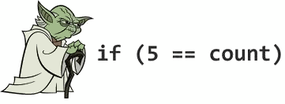

#  条件语句

条件语句体应该总是被大括号包围来避免错误，即使可以不用（比如，只有一行内容）。这些错误包括多加了第二行，并且误以为它是 if 语句体里面的。此外，更危险的可能是，如果把 if 语句体里的一行注释掉了，之后的一行代码会不知不觉成为 if 语句里的代码。

**推荐:**

```objective-c
if (!error) {
    return success;
}
```

**不推荐:**

```objective-c
if (!error)
    return success;
```

或者

```objective-c
if (!error) return success;
```


在 2014年2月 苹果的 SSL/TLS 实现里面发现了知名的 [goto fail](https://gotofail.com/) 错误。

代码在这里：


```objective-c
static OSStatus
SSLVerifySignedServerKeyExchange(SSLContext *ctx, bool isRsa, SSLBuffer signedParams,
                                 uint8_t *signature, UInt16 signatureLen)
{
  OSStatus        err;
  ...

  if ((err = SSLHashSHA1.update(&hashCtx, &serverRandom)) != 0)
    goto fail;
  if ((err = SSLHashSHA1.update(&hashCtx, &signedParams)) != 0)
    goto fail;
    goto fail;
  if ((err = SSLHashSHA1.final(&hashCtx, &hashOut)) != 0)
    goto fail;
  ...

fail:
  SSLFreeBuffer(&signedHashes);
  SSLFreeBuffer(&hashCtx);
  return err;
}
```


显而易见，这里有没有括号包围的2行连续的 `goto fail;` 。我们当然不希望写出上面的代码导致出现错误。

此外，在其他条件语句里面也应该按照这种风格统一，这样更便于检查。

## 尤达表达式


不要使用尤达表达式。尤达表达式是指，拿一个常量去和变量比较而不是拿变量去和常量比较。它就像是在表达 “蓝色是不是天空的颜色” 或者 “高个是不是这个男人的属性” 而不是  “天空是不是蓝的” 或者 “这个男人是不是高个子的” 



（译者注：名字起源于星球大战中尤达大师的讲话方式，总是用倒装的语序）

**推荐:**
```objective-c
if ([myValue isEqual:@42]) { ...
```

**不推荐:**
```objective-c
if ([@42 isEqual:myValue]) { ...
```

## nil 和 BOOL 检查

On a similar note of the Yoda conditions, also the nil check has been at the centre of debates. Some notous libraries out there use to check for an object to be or not to be nil as so:

【疑问】
类似于 Yoda 表达式，nil 检查的方式也是存在争议的。一些 notous 库 像这样检查对象是否为 nil：

```objective-c
if (nil == myValue) { ...
```

或许有人会提出这是错的，因为在 nil 作为一个常量的情况下，这样做就像 Yoda 表达式了。 但是一些程序员这么做的原因是为了避免调试的困难，看下面的代码：

```objective-c
if (myValue == nil) { ...
```

如果程序员敲错成这样：

```objective-c
if (myValue = nil) { ...
```


这是合法的语句，但是即使你是一个丰富经验的程序员，即使盯着眼睛瞧上好多遍也很难调试出错误。但是如果把 nil 放在左边，因为它不能被赋值，所以就不会发生这样的错误。 如果程序员这样做，他/她就可以轻松检查出可能的原因，比一遍一遍查看敲下的代码要好很多。

为了避免这些奇怪的问题，途径是使用感叹号来判断。因为 nil 是 解释到 NO 所以没必要在条件语句里面把它和其他值比较。同时，不要直接把它和 `YES` 比较，因为 `YES` 的定义是 1 而 `BOOL` 是 8 位的，实际上是 char 类型。

**推荐:**
```objective-c
if (someObject) { ...
if (![someObject boolValue]) { ...
if (!someObject) { ...
```

**不推荐:**
```objective-c
if (someObject == YES) { ... // Wrong
if (myRawValue == YES) { ... // Never do this.
if ([someObject boolValue] == NO) { ...
```

这样同时也能提高一致性，以及提升可读性。

## 黄金大道

当编写条件语句的时候，左边的代码间距应该是一个“黄金”或者“快乐”的大道。 这是说，不要嵌套`if`语句。多个 return 语句是OK的。这样可以避免 Cyclomatic 复杂性，并且让代码更加容易阅读。因为你的方法的重要的部分没有嵌套在分支上，你可以很清楚地找到相关的代码。

**推荐:**

```objective-c
- (void)someMethod {
  if (![someOther boolValue]) {
      return;
  }

  //Do something important
}
```

**不推荐:**

```objective-c
- (void)someMethod {
  if ([someOther boolValue]) {
    //Do something important
  }
}
```
## 复杂的表达式 

当你有一个复杂的 if 子句的时候，你应该把它们提取出来赋给一个 BOOL 变量，这样可以让逻辑更清楚，而且让每个子句的意义体现出来


```objective-c
BOOL nameContainsSwift  = [sessionName containsString:@"Swift"];
BOOL isCurrentYear      = [sessionDateCompontents year] == 2014;
BOOL isSwiftSession     = nameContainsSwift && isCurrentYear;

if (isSwiftSession) {
    // Do something very cool
}
```

## 三元运算符


三元运算符 ? 应该只用在它能让代码更加清楚的地方。 一个条件语句的所有的变量应该是已经被求值了的。计算多个条件子句通常会让语句更加难以理解，就像if语句的情况一样，或者把它们重构到实例变量里面。


**推荐:**
```objective-c
result = a > b ? x : y;
```

**不推荐:**
```objective-c
result = a > b ? x = c > d ? c : d : y;
```

当三元运算符的第二个参数（if 分支）返回和条件语句中已经检查的对象一样的对象的时候，下面的表达方式更灵巧：

**推荐:**
```objective-c
result = object ? : [self createObject];
```

**不推荐:**
```objective-c
result = object ? object : [self createObject];
```

## 错误处理

当方法返回一个错误参数的引用的时候，检查返回值，而不是错误的变量。

**推荐:**
```objective-c
NSError *error = nil;
if (![self trySomethingWithError:&error]) {
    // Handle Error
}
```

此外，一些苹果的 API 在成功的情况下会对 error 参数（如果它非 NULL）写入垃圾值（garbage values），所以如果检查 error 的值可能导致错误 （甚至崩溃）。